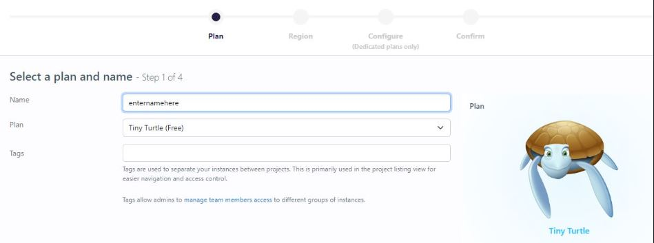
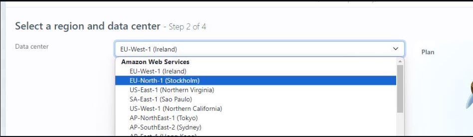
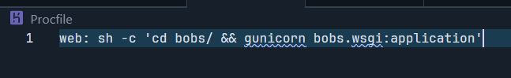
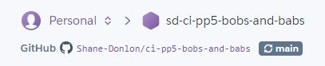
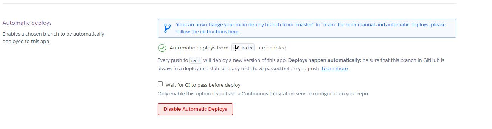
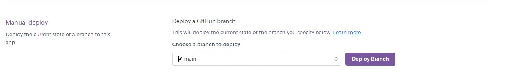
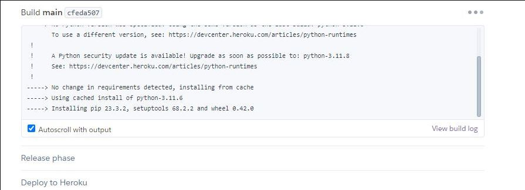

# Deployment

- The app was deployed to [Heroku](https:/www.heroku.com/).
- The database was deployed to [ElephantSQL](https:/www.elephantsql.com/).

- The app can be reached by the [link](https:/ci-sd-pp4-swarms-ie-54c976de26c1.herokuapp.com/).

## Local deployment

_Note:_

- This project requires to install all the requirements:
- Open the terminal window and type:
- `pip3 install -r requirements.txt`

Create a local copy of the GitHub repository by following one of the two processes below:

- Download ZIP file:

  1. Go to the [GitHub Repo page](https:/github.com/Shane-Donlon/ci-pp4-django).
  1. Click the Code button and download the ZIP file containing the project.
  1. Extract the ZIP file to a location on your PC.

- Clone the repository:
  1. Open a folder on your computer with the terminal.
  1. Run the following command
  - `git clone https:/github.com/Shane-Donlon/ci-pp4-django.git`

1. Install the dependencies:

   - Open the terminal window and type:
   - `pip3 install -r requirements.txt`

1. Create a `.gitignore` file in the root directory of the project where you should add env.py and **pycache** files to prevent the privacy of your secret data.

1. Create a `.env` file. This will contain the following environment variables:

   ```python
   import os

     os.environ['SECRET_KEY'] = 'Add a secret key'
     os.environ['DATABASE_URL'] = 'will be used to connect to the database'
     os.environ['CLOUDINARY_URL'] = 'will be used to store the images on report upload'
     os.environ['DEBUG'] = 'True'
     os.environ["STRIPE_API_KEY"] = "STRIPE API KEY"
     os.environ["SENDGRID_API_KEY"] = "SEND GRID API KEY"
     os.environ["EMAIL_HOST_PASSWORD"] = "Password"
     os.environ["EMAIL_HOST_USER"] = "Email address"

   ```

   _During the development stage DEBUG is set to True, but it is vital to change it to False._

1. Run the following commands in a terminal to make migrations:
   - `python3 manage.py makemigrations`
   - `python3 manage.py migrate`
1. Create a superuser to get access to the admin environment.
   - `python3 manage.py createsuperuser`
   - Enter the required information (your username, email and password).
1. Run the app with the following command in the terminal:
   - `python3 manage.py runserver`
1. Open the link provided in a browser to see the app.

1. If you need to access the admin page:
   - Add /admin/ to the link provided.
   - Enter your username and password (for the superuser that you have created before).
   - You will be redirected to the admin page.

### Create Database on ElephantSQL

- Set debug to False locally + delete DISABLE_COLLECTSTATIC from config vars in Heroku dashboard.
- Commit and push the changes to GitHub.

1. Go to [ElephantSQL](https:/www.elephantsql.com/) and create a new account.

2. Create a new instance of the database.

   - 

3. Select a name for your database and select the free plan.

   - 

4. Click "Select Region"

5. Select a region close to you.

   - 

6. Click "Review"

   - 

7. Click "Create Instance"

8. Click on the name of your database to open the dashboard.

   - 
   - 

9. You will see the dashboard of your database. You will need the URL of your database to connect it to your Django project.

## Heroku Deployment

- Set up a local workspace on your computer for Heroku:
  - Create a list of requirements that the project needs to run:
    - type this in the terminal: `pip3 freeze > requirements.txt`
  - Commit and push the changes to GitHub
- Go to [www.heroku.com](www.heroku.com)
- Log in or create a Heroku account.
- Create a new app with any unique name <name app>.
  

* Create a Procfile in your local workplace:
  

  This file will contain the following:

  ```python
  web: sh -c 'cd <name app> / && gunicorn <name app>.wsgi:application'
  ```

  - Commit and push the changes to GitHub.
    

* Go to the settings app in Heroku and go to Config Vars.

  

  

| Key                   | Value |
| --------------------- | ----- |
| DATABASE_URL          | ...   |
| DISABLE_COLLECTSTATIC | 1     |
| SECRET_KEY            | ...   |
| CLOUDINARY_URL        | ...   |
| STRIPE_API_KEY        | ...   |
| SENDGRID_API_KEY      | ...   |
| EMAIL_HOST_PASSWORD   | ...   |
| EMAIL_HOST_USER       | ...   |

- Copy the value of DATABASE_URL and input it into the .env file and generate a secret key (you may use [Djecrety](https:/djecrety.ir/) for secret key generation).

* Migrate changes.
* Set debug to False in settings.py
* Commit and push the changes to GitHub.
* Connect your repository to Heroku.

  

* Deploy the app to Heroku by clicking "Deploy Branch" button. If you want to enable auto-deployment, click "Enable Automatic Deployment".



The deployment process will start.


- You will see a confirmation screen appear at the bottom of the screen

  

**Final Deployment**

- Set debug to False locally + delete DISABLE_COLLECTSTATIC from config vars in Heroku dashboard.
- Commit and push the changes to GitHub.
