[link to deployed site](https://sd-ci-pp5-bobs-and-babs-5fa3ca5e7225.herokuapp.com/)

# Bob & Bab's e-commerce website

Bob & Babs website is a store that sells freshly baked goods in the Dublin Area.
This has been built using Django, HTML, CSS and JavaScript, stripe and is hosted on Heroku.
AdobeXD was also used for the low-fidelity wireframes, and Photoshop for the assets.

## Site goals:

- Sell freshly baked goods to the Dublin Area
- Provide delivery and collection services
- Provide a user-friendly experience
- Provide a secure payment system

## Technologies Used:

### Languages:

- HTML
- CSS
- JavaScript
- Python
- Django
- Node.JS
- Powershell

Node.JS was used to create bespoke VSCode Extensions to improve my Developer Experience with Django.
Django Custom Commands Extension was created to allow me to run Django Custom Commands from within VSCode.

### Django Custom Commands Extension:

This allowed me to utilise Python to create and update Apps with ease.
On new app creation the extension will automatically create the necessary files, and folders for the app.
As well as migrate all the template tags from the base.html file into the current HTML file.

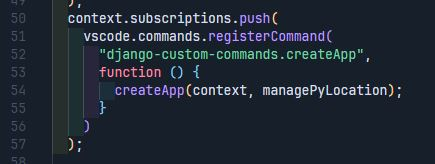

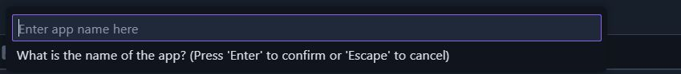
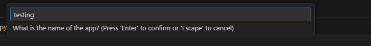
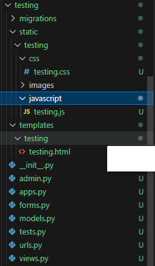
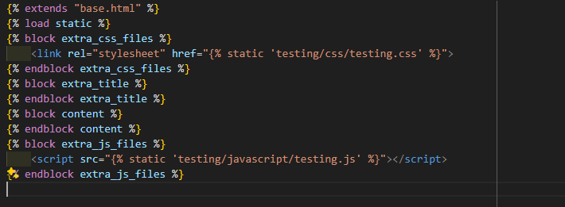

The extension would also update the base urls.py file to include the new app's url.
This would then update my settings.py file installed apps to include the new application
This also allowed me to create custom commands to run from the terminal in VSCode, and adding keyboard shortcuts to run these commands.

As well as to automatically comment on closing divs, and section tags in html files using beautiful soup as the HTML parser.

### Githooks:

Custom githooks were created for commit-msg and pre-push hooks
The purpose of these hooks were to ensure that the commit message was in the correct format, and that I was informed of an attempt to push debug code, conosle.log(), print() statements appropriately.

Powershell was used to create the hooks, and the hooks were stored in the hooks folder in the root directory of the project.

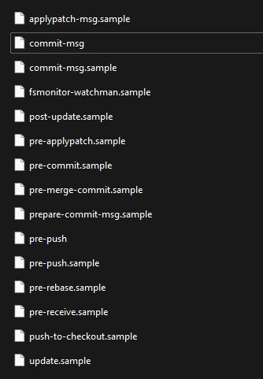

### Tools:

- Github
- Githooks

### Libraries:

- allauth
- django_browser_reload
- cloudinary
- django-tables2
- stripe
- sendgrid
- typing_extensions
- gunicorn
- whitenoise
- dj-database-url
- psycopg2-binary

### Hosting:

Heroku

### Features:

  
Homepage

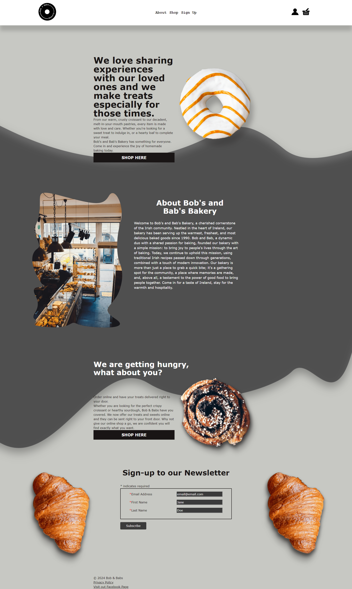

  
Shop

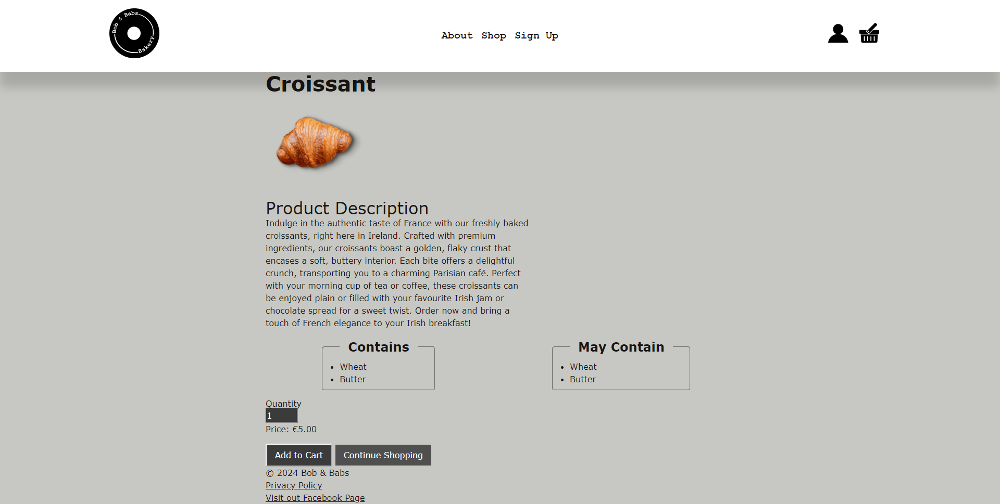

  
Product

It was important to route to this page as part of the add to cart option to ensure the allergin information is seen

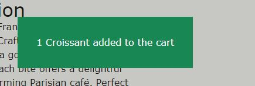
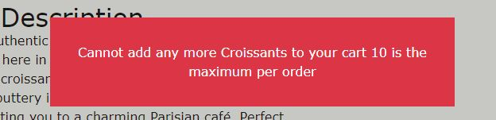

  
Cart

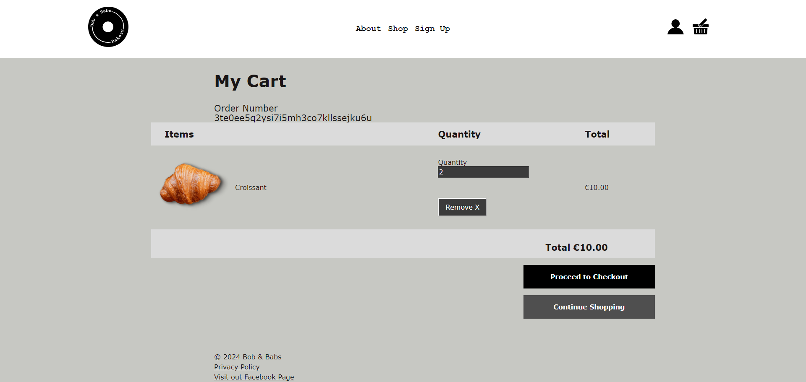

  
Checkout Page Delivery

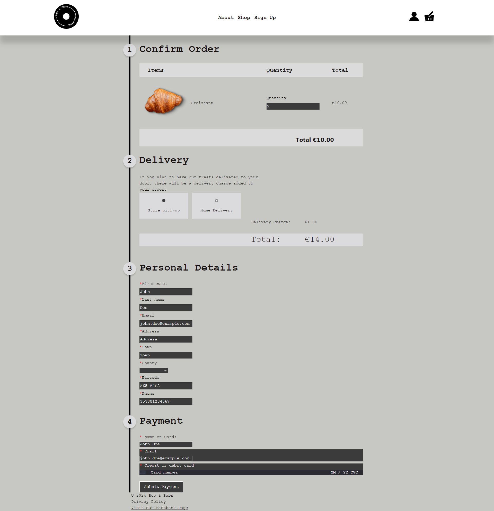

  
Checkout Page Collection

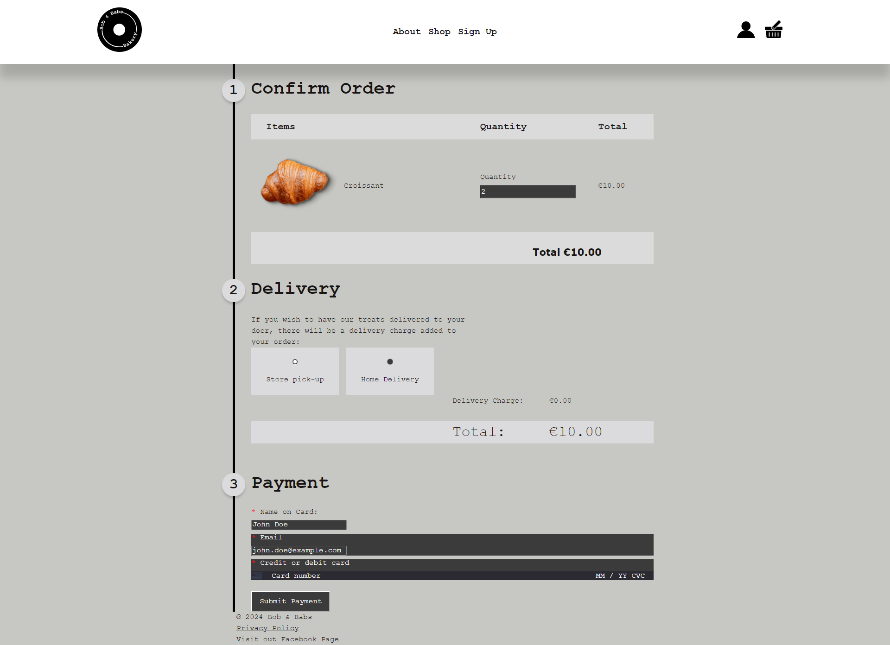

  
Order Success

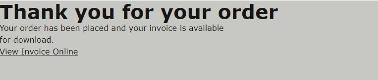

  
Order Failure

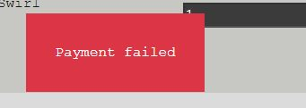

  
Form Validation

  
Signup

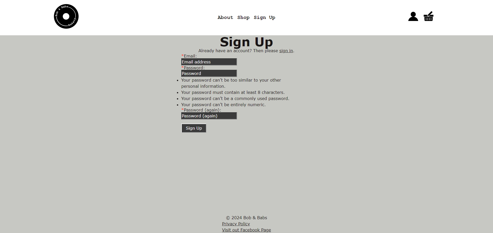

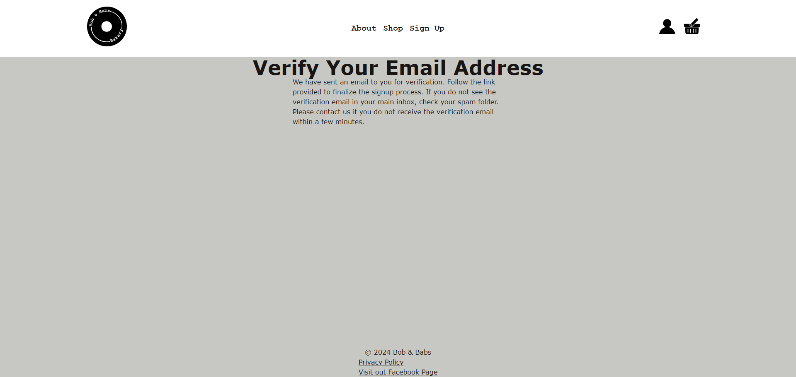

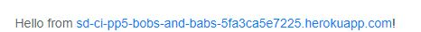

  
Sign In

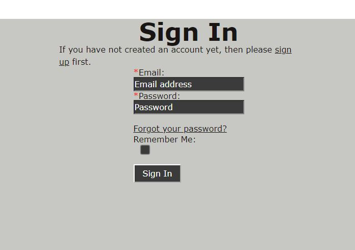

  
Profile Page

Where "Prefilled" is the email address used to sign up (hidden for screenshots)

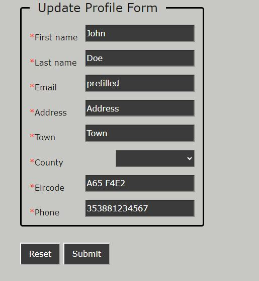

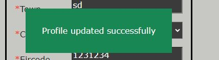

  
Logout Page

### Wireframes & Styling

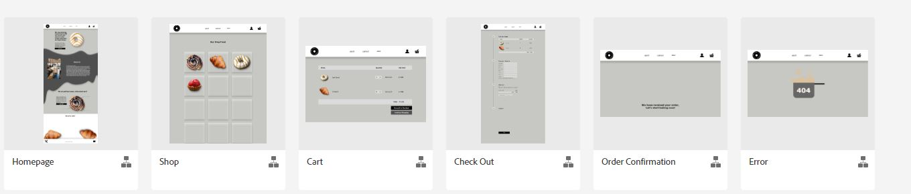

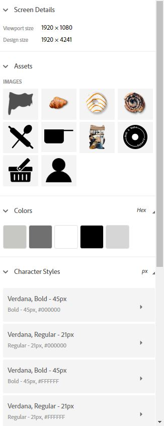

### Entity Relationship Diagram (ERD)

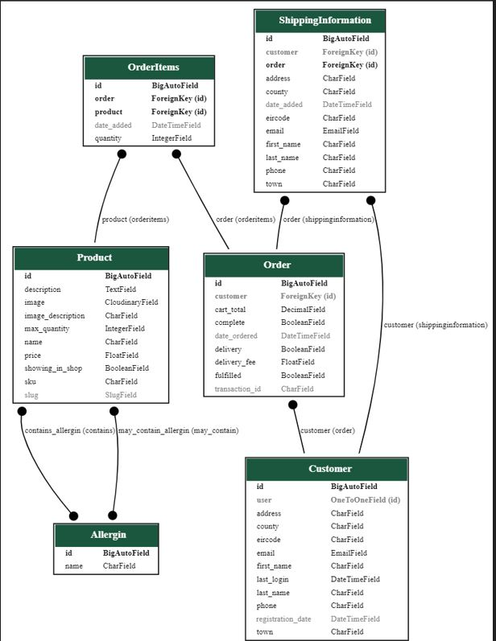

- Order Items holds the indiviaul products per order
- Shipping information holds all shipping information (which may or may not include a customer)
  The reason for this is to support unauthenticated users

### Unauthenticated Users

This site supports purchases from unauthenticated users.

This is supported by creating and storing a session key
This session key is stored in the 'users session', and is used to store the cart items for the user
If the user starts unauthenticated then logs in or creates an account the order is transferred over to the customer order
if a current order exists the items are added to the current order and the unauthenticated order is removed

The use of session keys also works along with closing browser or navigating away from the page

Please note this feature will not work in incognito mode as this clears the session key on browser exit

### Improvements:

I would like to add the GDPR Banner for cookies,
While all cookies are purely functional it is still a requirement to add this,
also the fact that the site uses authentication is another reason to include this banner as Django uses session keys to track authenticated users
