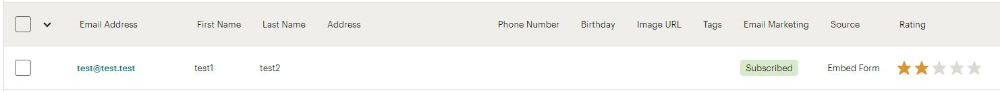

## Stripe testing cards successful

Name on card: anything eg test test

Email address: anything test@test.test

Card Number: 4242 4242 4242 4242

Expiry Date: any future date 12 34

CVC: any 3 digits 123

## Stripe testing cards unsuccessful

Name on card: anything eg test test

Email address: anything test@test.test

Card Number: 4000000000000002

Expiry Date: any future date 12 34

CVC: any 3 digits 123

<table>
  <thead>
    <tr>
      <th>Page</th>
      <th>Acting as	</th>
      <th>User Actions</th>
      <th>Expected Result</th>
      <th>Y/N (Yes/No)</th>
      <th>Comments</th>
    </tr>

  </thead>
<tbody>
  <tr>
    <td>Homepage</td>
    <td>Customer Un-authenticated</td>
    <td>Signup form</td>
    <td>Thanks for subscribing>
    <td>Yes</td>
    <td>see image 1 & 1.1 below</td>
  </tr>
  <tr>
    <td>Homepage</td>
    <td>Customer Un-authenticated</td>
    <td>Shop Now link </td>
    <td>goes to products page </td>
    <td>Yes</td>
    <td></td>
  </tr>
    <tr>
    <td>Homepage</td>
    <td>Customer Un-authenticated</td>
    <td>About nav link </td>
    <td>From homepage page should not refresh </td>
    <td>Yes</td>
    <td></td>
  </tr>
    <tr>
    <td>Homepage</td>
    <td>Customer Un-authenticated</td>
    <td>Shop nav link </td>
    <td>Goes to products page </td>
    <td>Yes</td>
    <td></td>
  </tr>
     <tr>
    <td>Homepage</td>
    <td>Customer Un-authenticated</td>
    <td>login nav link </td>
    <td>Goes to login page </td>
    <td>Yes</td>
    <td></td>
  </tr>
     <tr>
    <td>Homepage</td>
    <td>Customer Un-authenticated</td>
    <td>Sign-up nav link </td>
    <td>Goes to signup page </td>
    <td>Yes</td>
    <td></td>
  </tr>
       <tr>
    <td>Homepage</td>
    <td>Customer Un-authenticated</td>
    <td>Cart nav link </td>
    <td>Continue shopping if cart is empty </td>
    <td>Yes</td>
    <td></td>
  </tr>
         <tr>
    <td>Homepage</td>
    <td>Customer Un-authenticated</td>
    <td>Cart nav link </td>
    <td>Cart page if cart has items </td>
    <td>Yes</td>
    <td></td>
  </tr>
    <tr>
    <td>Shop</td>
    <td>Customer Un-authenticated</td>
    <td>About nav link </td>
    <td>Goes to home page about section </td>
    <td>Yes</td>
    <td></td>
  </tr>
    <tr>
    <td>Shop</td>
    <td>Customer Un-authenticated</td>
    <td>Shop nav link </td>
    <td>Goes to products page </td>
    <td>Yes</td>
    <td></td>
  </tr>
     <tr>
    <td>Shop</td>
    <td>Customer Un-authenticated</td>
    <td>login nav link </td>
    <td>Goes to login page </td>
    <td>Yes</td>
    <td></td>
  </tr>
     <tr>
    <td>Shop</td>
    <td>Customer Un-authenticated</td>
    <td>Sign-up nav link </td>
    <td>Goes to signup page </td>
    <td>Yes</td>
    <td></td>
  </tr>
       <tr>
    <td>Shop</td>
    <td>Customer Un-authenticated</td>
    <td>Cart nav link </td>
    <td>Continue shopping if cart is empty </td>
    <td>Yes</td>
    <td></td>
  </tr>
         <tr>
    <td>Shop</td>
    <td>Customer Un-authenticated</td>
    <td>Cart nav link </td>
    <td>Cart page if cart has items </td>
    <td>Yes</td>
    <td></td>
  </tr>
    <tr>
    <td>Sign up </td>
    <td>Customer Un-authenticated</td>
    <td>About nav link </td>
    <td>Goes to home page about section </td>
    <td>Yes</td>
    <td></td>
  </tr>
    <tr>
    <td>Sign up </td>
    <td>Customer Un-authenticated</td>
    <td>Shop nav link </td>
    <td>Goes to products page </td>
    <td>Yes</td>
    <td></td>
  </tr>
     <tr>
    <td>Sign up </td>
    <td>Customer Un-authenticated</td>
    <td>login nav link </td>
    <td>Goes to login page </td>
    <td>Yes</td>
    <td></td>
  </tr>
     <tr>
    <td>Sign up </td>
    <td>Customer Un-authenticated</td>
    <td>Sign-up nav link </td>
    <td>Goes to signup page </td>
    <td>Yes</td>
    <td></td>
  </tr>
       <tr>
    <td>Sign up </td>
    <td>Customer Un-authenticated</td>
    <td>Cart nav link </td>
    <td>Continue shopping if cart is empty </td>
    <td>Yes</td>
    <td></td>
  </tr>
         <tr>
     <td>Sign up </td>
    <td>Customer Un-authenticated</td>
    <td>Cart nav link </td>
    <td>Cart page if cart has items </td>
    <td>Yes</td>
    <td></td>
  </tr>
    <tr>
    <td>Sign in </td>
    <td>Customer Un-authenticated</td>
    <td>About nav link </td>
    <td>Goes to home page about section </td>
    <td>Yes</td>
    <td></td>
  </tr>
    <tr>
     <td>Sign in </td>
    <td>Customer Un-authenticated</td>
    <td>Shop nav link </td>
    <td>Goes to products page </td>
    <td>Yes</td>
    <td></td>
  </tr>
     <tr>
     <td>Sign in </td>
    <td>Customer Un-authenticated</td>
    <td>login nav link </td>
    <td>Goes to login page </td>
    <td>Yes</td>
    <td></td>
  </tr>
     <tr>
    <td>Sign in </td>
    <td>Customer Un-authenticated</td>
    <td>Sign-up nav link </td>
    <td>Goes to signup page </td>
    <td>Yes</td>
    <td></td>
  </tr>
       <tr>
    <td>Sign in </td>
    <td>Customer Un-authenticated</td>
    <td>Cart nav link </td>
    <td>Continue shopping if cart is empty </td>
    <td>Yes</td>
    <td></td>
  </tr>
         <tr>
    <td>Sign in </td>
    <td>Customer Un-authenticated</td>
    <td>Cart nav link </td>
    <td>Cart page if cart has items </td>
    <td>Yes</td>
    <td></td>
  </tr>
    <tr>
    <td>Cart </td>
    <td>Customer Un-authenticated</td>
    <td>About nav link </td>
    <td>Goes to home page about section </td>
    <td>Yes</td>
    <td></td>
  </tr>
    <tr>
    <td>Cart </td>
    <td>Customer Un-authenticated</td>
    <td>Shop nav link </td>
    <td>Goes to products page </td>
    <td>Yes</td>
    <td></td>
  </tr>
     <tr>
      <td>Cart </td>
    <td>Customer Un-authenticated</td>
    <td>login nav link </td>
    <td>Goes to login page </td>
    <td>Yes</td>
    <td></td>
  </tr>
     <tr>
       <td>Cart </td>
    <td>Customer Un-authenticated</td>
    <td>Sign-up nav link </td>
    <td>Goes to signup page </td>
    <td>Yes</td>
    <td></td>
  </tr>
       <tr>
     <td>Cart </td>
    <td>Customer Un-authenticated</td>
    <td>Cart nav link </td>
    <td>Continue shopping if cart is empty </td>
    <td>Yes</td>
    <td></td>
  </tr>
         <tr>
      <td>Cart </td>
    <td>Customer Un-authenticated</td>
    <td>Cart nav link </td>
    <td>Cart page if cart has items </td>
    <td>Yes</td>
    <td></td>
  </tr>
      <tr>
    <td>Checkout </td>
    <td>Customer Un-authenticated</td>
    <td>About nav link </td>
    <td>Goes to home page about section </td>
    <td>Yes</td>
    <td></td>
  </tr>
    <tr>
    <td>Checkout </td>
    <td>Customer Un-authenticated</td>
    <td>Shop nav link </td>
    <td>Goes to products page </td>
    <td>Yes</td>
    <td></td>
  </tr>
     <tr>
      <td>Checkout </td>
    <td>Customer Un-authenticated</td>
    <td>login nav link </td>
    <td>Goes to login page </td>
    <td>Yes</td>
    <td></td>
  </tr>
     <tr>
       <td>Checkout </td>
    <td>Customer Un-authenticated</td>
    <td>Sign-up nav link </td>
    <td>Goes to signup page </td>
    <td>Yes</td>
    <td></td>
  </tr>
       <tr>
     <td>Checkout </td>
    <td>Customer Un-authenticated</td>
    <td>Cart nav link </td>
    <td>Continue shopping if cart is empty </td>
    <td>Yes</td>
    <td></td>
  </tr>
         <tr>
      <td>Checkout </td>
    <td>Customer Un-authenticated</td>
    <td>Cart nav link </td>
    <td>Cart page if cart has items </td>
    <td>Yes</td>
    <td></td>
  </tr>
    <tr>
    <td>Homepage</td>
    <td>Customer Authenticated</td>
    <td>Signup form</td>
    <td>Thanks for subscribing>
    <td>Yes</td>
    <td>see image 1 & 1.1 below</td>
  </tr>
  <tr>
    <td>Homepage</td>
    <td>Customer Authenticated</td>
    <td>Shop Now link </td>
    <td>goes to products page </td>
    <td>Yes</td>
    <td></td>
  </tr>
    <tr>
    <td>Homepage</td>
    <td>Customer Authenticated</td>
    <td>About nav link </td>
    <td>From homepage page should not refresh </td>
    <td>Yes</td>
    <td></td>
  </tr>
    <tr>
    <td>Homepage</td>
    <td>Customer Authenticated</td>
    <td>Shop nav link </td>
    <td>Goes to products page </td>
    <td>Yes</td>
    <td></td>
  </tr>
     <tr>
    <td>Homepage</td>
    <td>Customer Authenticated</td>
    <td>login nav link </td>
 <td>Goes to account page </td>
    <td>Yes</td>
    <td></td>
  </tr>
       <tr>
    <td>Homepage</td>
    <td>Customer Authenticated</td>
    <td>Cart nav link </td>
    <td>Continue shopping if cart is empty </td>
    <td>Yes</td>
    <td></td>
  </tr>
         <tr>
    <td>Homepage</td>
    <td>Customer Authenticated</td>
    <td>Cart nav link </td>
    <td>Cart page if cart has items </td>
    <td>Yes</td>
    <td></td>
  </tr>
    <tr>
    <td>Shop</td>
    <td>Customer Authenticated</td>
    <td>About nav link </td>
    <td>Goes to home page about section </td>
    <td>Yes</td>
    <td></td>
  </tr>
    <tr>
    <td>Shop</td>
      <td>Customer Authenticated</td>
    <td>Shop nav link </td>
    <td>Goes to products page </td>
    <td>Yes</td>
    <td></td>
  </tr>
     <tr>
    <td>Shop</td>
    <td>Customer Authenticated</td>
    <td>login nav link </td>
 <td>Goes to account page </td>
    <td>Yes</td>
    <td></td>
  </tr>
       <tr>
    <td>Shop</td>
    <td>Customer Authenticated</td>
    <td>Cart nav link </td>
    <td>Continue shopping if cart is empty </td>
    <td>Yes</td>
    <td></td>
  </tr>
         <tr>
    <td>Shop</td>
     <td>Customer Authenticated</td>
    <td>Cart nav link </td>
    <td>Cart page if cart has items </td>
    <td>Yes</td>
    <td></td>
  </tr>
    <tr>
    <td>Sign up </td>
    <td>Customer Authenticated</td>
    <td>About nav link </td>
    <td>Goes to home page about section </td>
    <td>Yes</td>
    <td></td>
  </tr>
    <tr>
    <td>Sign up </td>
    <td>Customer Authenticated</td>
    <td>Shop nav link </td>
    <td>Goes to products page </td>
    <td>Yes</td>
    <td></td>
  </tr>
     <tr>
    <td>Sign up </td>
    <td>Customer Authenticated</td>
    <td>login nav link </td>
 <td>Goes to account page </td>
    <td>Yes</td>
    <td></td>
  </tr>
       <tr>
    <td>Sign up </td>
    <td>Customer Authenticated</td>
    <td>Cart nav link </td>
    <td>Continue shopping if cart is empty </td>
    <td>Yes</td>
    <td></td>
  </tr>
         <tr>
     <td>Sign up </td>
    <td>Customer Authenticated</td>
    <td>Cart nav link </td>
    <td>Cart page if cart has items </td>
    <td>Yes</td>
    <td></td>
  </tr>
    <tr>
    <td>Sign in </td>
      <td>Customer Authenticated</td>
    <td>About nav link </td>
    <td>Goes to home page about section </td>
    <td>Yes</td>
    <td></td>
  </tr>
    <tr>
     <td>Sign in </td>
       <td>Customer Authenticated</td>
    <td>Shop nav link </td>
    <td>Goes to products page </td>
    <td>Yes</td>
    <td></td>
  </tr>
     <tr>
     <td>Sign in </td>
       <td>Customer Authenticated</td>
    <td>login nav link </td>
 <td>Goes to account page </td>
    <td>Yes</td>
    <td></td>
  </tr>
       <tr>
    <td>Sign in </td>
    <td>Customer Authenticated</td>
    <td>Cart nav link </td>
    <td>Continue shopping if cart is empty </td>
    <td>Yes</td>
    <td></td>
  </tr>
         <tr>
    <td>Sign in </td>
    <td>Customer Authenticated</td>
    <td>Cart nav link </td>
    <td>Cart page if cart has items </td>
    <td>Yes</td>
    <td></td>
  </tr>
    <tr>
    <td>Cart </td>
    <td>Customer Authenticated</td>
    <td>About nav link </td>
    <td>Goes to home page about section </td>
    <td>Yes</td>
    <td></td>
  </tr>
    <tr>
    <td>Cart </td>
    <td>Customer Authenticated</td>
    <td>Shop nav link </td>
    <td>Goes to products page </td>
    <td>Yes</td>
    <td></td>
  </tr>
     <tr>
      <td>Cart </td>
    <td>Customer Authenticated</td>
    <td>login nav link </td>
 <td>Goes to account page </td>
    <td>Yes</td>
    <td></td>
  </tr>
       <tr>
     <td>Cart </td>
    <td>Customer Authenticated</td>
    <td>Cart nav link </td>
    <td>Continue shopping if cart is empty </td>
    <td>Yes</td>
    <td></td>
  </tr>
         <tr>
      <td>Cart </td>
    <td>Customer Authenticated</td>
    <td>Cart nav link </td>
    <td>Cart page if cart has items </td>
    <td>Yes</td>
    <td></td>
  </tr>
      <tr>
    <td>Checkout </td>
      <td>Customer Authenticated</td>
    <td>About nav link </td>
    <td>Goes to home page about section </td>
    <td>Yes</td>
    <td></td>
  </tr>
    <tr>
    <td>Checkout </td>
     <td>Customer Authenticated</td>
    <td>Shop nav link </td>
    <td>Goes to products page </td>
    <td>Yes</td>
    <td></td>
  </tr>
     <tr>
      <td>Checkout </td>
    <td>Customer Authenticated</td>
    <td>login nav link </td>
 <td>Goes to account page </td>
    <td>Yes</td>
    <td></td>
  </tr>
       <tr>
     <td>Checkout </td>
     <td>Customer Authenticated</td>
    <td>Cart nav link </td>
    <td>Continue shopping if cart is empty </td>
    <td>Yes</td>
    <td></td>
  </tr>
         <tr>
      <td>Checkout </td>
       <td>Customer Authenticated</td>
    <td>Cart nav link </td>
    <td>Cart page if cart has items </td>
    <td>Yes</td>
    <td></td>
  </tr>
  <tr>
    <td>Admin Authenticated</td>
    <td>Nav updates</td>
    <td>Admin portal</td>
    <td>Admin Portal</td>
    <td>Yes</td>
    <td>Data 6</td>
  </tr>
    <tr>
    <td>Admin Authenticated</td>
    <td>Nav updates</td>
    <td>Admin portal</td>
    <td>Admin Portal</td>
    <td>Yes</td>
    <td>Data 6</td>
  </tr>
    <tr>
    <td>All pages</td>
    <td>Admin Authenticated</td>
    <td>Branding link goes to index page</td>
    <td>Goes to home page</td>
    <td>Yes</td>
    <td></td>
  </tr>
     <tr>
    <td>All pages</td>
    <td>Customer un-authenticated</td>
    <td>Branding link goes to index page</td>
    <td>Branding link goes to index page<</td>
    <td>Yes</td>
    <td></td>
  </tr>
     <tr>
    <td>All pages</td>
    <td>Customer Authenticated</td>
    <td>Branding link goes to index page</td>
    <td>Branding link goes to index page<</td>
    <td>Yes</td>
    <td></td>
  </tr>
    <tr>
    <td>All pages</td>
    <td>Customer Authenticated</td>
    <td>Logout link</td>
    <td>Logout</td>
    <td>Yes</td>
    <td></td>
      </tr>
          <tr>
    <td>Product pages</td>
    <td>Customer Authenticated</td>
    <td>Add to cart button</td>
    <td>Adds less than 10 items to cart (set max in model)</td>
    <td>Yes</td>
    <td></td>
      </tr>
                <tr>
    <td>Product pages</td>
    <td>Customer Authenticated</td>
    <td>Add to cart button</td>
    <td>Error if more than 10 items to cart (set max in model)</td>
    <td>Yes</td>
    <td></td>
      </tr>
                <tr>
    <td>Product pages</td>
    <td>Customer un-authenticated</td>
    <td>Add to cart button</td>
    <td>Adds less than 10 items to cart (set max in model)</td>
    <td>Yes</td>
    <td></td>
      </tr>
                <tr>
    <td>Product pages</td>
    <td>Customer un-authenticated</td>
    <td>Add to cart button</td>
    <td>Error if more than 10 items to cart (set max in model)</td>
    <td>Yes</td>
    <td></td>
      </tr>
<tr>
    <td>Product pages</td>
       <td>Customer authenticated</td>
    <td>Add to cart button</td>
    <td>Confirmation success message</td>
    <td>Yes</td>
    <td></td>
      </tr>
                   <tr>
    <td>Product pages</td>
    <td>Customer authenticated</td>
    <td>Add to cart button</td>
   <td>Confirmation failure message if exceed 10</td>
    <td>Yes</td>
    <td></td>
      </tr>
    <tr>
    <td>Product pages</td>
    <td>Customer un-authenticated</td>
    <td>Add to cart button</td>
    <td>Confirmation failure message if exceed 10</td>
    <td>Yes</td>
    <td></td>
      </tr>
                  <tr>
    <td>Product pages</td>
       <td>Customer authenticated</td>
    <td>Continue Shopping link</td>
   <td>goes to products page</td>
    <td>Yes</td>
    <td></td>
      </tr>
                  <tr>
    <td>Product pages</td>
    <td>Customer un-authenticated</td>
    <td>Continue Shopping link</td>
   <td>goes to products page</td>
    <td>Yes</td>
    <td></td>
      </tr>
<tr>
    <td>cart pages</td>
       <td>Customer authenticated</td>
    <td>Empty cart</td>
   <td>Empty cart shows empty message</td>
    <td>Yes</td>
    <td></td>
      </tr>
  <tr>
    <td>cart pages</td>
       <td>Customer un-authenticated</td>
    <td>Empty cart</td>
   <td>Empty cart shows empty message</td>
    <td>Yes</td>
    <td></td>
      </tr>
    <tr>
    <td>cart pages</td>
       <td>Customer authenticated</td>
    <td>checkout link cart</td>
   <td>goes to checkout screen</td>
    <td>Yes</td>
    <td></td>
      </tr>
  <tr>
    <td>cart pages</td>
       <td>Customer un-authenticated</td>
     <td>checkout link cart</td>
   <td>goes to checkout screen</td>
    <td>Yes</td>
    <td></td>
   </tr>

  <tr>
    <td>checkout page</td>
       <td>Customer un-authenticated</td>
     <td>checkout success delivery</td>
   <td>goes to success page</td>
    <td>Yes</td>
    <td></td>
   </tr>
<tr>
    <td>checkout page</td>
       <td>Customer authenticated</td>
     <td>checkout success delivery</td>
   <td>goes to success page</td>
    <td>Yes</td>
    <td></td>
   </tr>
    <tr>
    <td>checkout page</td>
       <td>Customer un-authenticated</td>
     <td>checkout success collection</td>
   <td>goes to success page</td>
    <td>Yes</td>
    <td></td>
   </tr>
<tr>
    <td>checkout page</td>
       <td>Customer authenticated</td>
     <td>checkout success collection</td>
   <td>goes to success page</td>
    <td>Yes</td>
    <td></td>
   </tr>
      </tr>
<tr>
    <td>checkout page</td>
       <td>Customer authenticated</td>
     <td>form validation error on empty fields</td>
   <td>Error message appears on change</td>
    <td>Yes</td>
    <td></td>
   </tr>
<tr>
    <td>checkout page</td>
       <td>Customer un-authenticated</td>
     <td>form validation error on empty fields</td>
   <td>Error message appears on change</td>
    <td>Yes</td>
    <td></td>
   </tr>
   <tr>
    <td>checkout page</td>
       <td>Customer un-authenticated</td>
     <td>form validation error incorrect eircode</td>
   <td>Error message appears on change</td>
    <td>Yes</td>
    <td></td>
   </tr>
   <tr>
    <td>checkout page</td>
       <td>Customer authenticated</td>
 <td>form validation error incorrect eircode</td>
   <td>Error message appears on change</td>
    <td>Yes</td>
    <td></td>
   </tr>
   <tr>
    <td>checkout page</td>
       <td>Customer authenticated</td>
     <td>form validation error on empty fields</td>
   <td>Error message appears on submit</td>
    <td>Yes</td>
    <td>Standard HTML Validation</td>
   </tr>
<tr>
    <td>checkout page</td>
       <td>Customer un-authenticated</td>
     <td>form validation error on empty fields</td>
   <td>Error message appears on submit</td>
    <td>Yes</td>
    <td></td>
   </tr>
   <tr>
    <td>checkout page</td>
       <td>Customer un-authenticated</td>
     <td>form validation error incorrect eircode</td>
    <td>Error message appears on submit</td>
    <td>Yes</td>
    <td>Standard HTML Validation</td>
   </tr>
   <tr>
    <td>checkout page</td>
       <td>Customer authenticated</td>
 <td>form validation error incorrect eircode</td>
   <td>Error message appears on submit</td>
    <td>Yes</td>
    <td>Custom HTML Validation</td>
   </tr>
      <tr>
    <td>checkout page</td>
       <td>Customer un-authenticated</td>
     <td>form validation error incorrect phone number</td>
    <td>Error message appears on submit</td>
    <td>Yes</td>
    <td>Standard HTML Validation</td>
   </tr>
   <tr>
    <td>checkout page</td>
       <td>Customer authenticated</td>
 <td>form validation error incorrect phone number</td>
   <td>Error message appears on submit</td>
    <td>Yes</td>
    <td>Custom HTML Validation</td>
   </tr>
      <tr>
       <td>checkout page</td>
       <td>Customer un-authenticated</td>
     <td>form validation credit card field</td>
    <td>Error message appears on submit</td>
    <td>Yes</td>
    <td>Standard HTML Validation</td>
   </tr>
   <tr>
    <td>checkout page</td>
       <td>Customer authenticated</td>
     <td>form validation credit card field</td>
   <td>Error message appears on submit</td>
    <td>Yes</td>
    <td>Standard HTML Validation</td>
   </tr>
      <tr>
    <td>checkout page</td>
       <td>Customer authenticated</td>
     <td>submit validation</td>
   <td>Error message appears on submit</td>
    <td>Yes</td>
    <td>Server error message failed payment</td>
   </tr>
         <tr>
    <td>checkout page</td>
       <td>Customer authenticated</td>
     <td>submit validation</td>
   <td>Create Notification appears on submit</td>
    <td>Yes</td>
    <td>Server  message success payment</td>
   </tr>
    <tr>
       <td>Account Profile Form</td>
       <td>Customer authenticated</td>
     <td>form validation all fields</td>
    <td>Error message appears on submit</td>
    <td>Yes</td>
    <td>Standard HTML Validation</td>
   </tr>
    <tr>
       <td>Account Profile Form</td>
       <td>Customer authenticated</td>
 <td>form validation error incorrect phone number</td>
   <td>Error message appears on submit</td>
    <td>Yes</td>
    <td>Custom HTML Validation</td>
   </tr>
  <tr>
       <td>Account Profile Form</td>
       <td>Customer authenticated</td>
 <td>form validation error incorrect eircode field</td>
   <td>Error message appears on change</td>
    <td>Yes</td>
    <td>Custom HTML Validation</td>
   </tr>
     <tr>
       <td>Admin Orders</td>
       <td>Admin authenticated</td>
 <td>Admin can fulfill order</td>
   <td>Create Notification appears on submit</td>
    <td>Yes</td>
    <td>Server  message success fulfilled</td>
   </tr>
        <tr>
       <td>Admin products add</td>
       <td>Admin authenticated</td>
 <td>Admin can add products</td>
   <td>Create Notification appears on submit</td>
    <td>Yes</td>
    <td>Server  message success product name added</td>
   </tr>
        <tr>
       <td>Admin products add</td>
       <td>Admin authenticated</td>
 <td>Admin can update products</td>
   <td>Create Notification appears on submit</td>
    <td>Yes</td>
    <td>Server  message success product name added</td>
   </tr>
           <tr>
       <td>Admin Portal</td>
       <td>Customer authenticated</td>
 <td>Cannot access admin area</td>
 <td>Cannot access admin area</td>
    <td>Yes</td>
    <td></td>
   </tr>
          <tr>
       <td>Admin Orders</td>
       <td>Customer authenticated</td>
 <td>Cannot access admin area</td>
 <td>Cannot access admin area</td>
    <td>Yes</td>
    <td></td>
   </tr>
             <tr>
       <td>Other customers transactions</td>
       <td>Customer authenticated</td>
 <td>Cannot access transactions that are not theirs</td>
 <td>Cannot access transactions that are not theirs</td>
    <td>Yes</td>
    <td></td>
   </tr>
                <tr>
       <td>Accessing any transaction</td>
       <td>Customer un-authenticated</td>
 <td>Cannot access transactions </td>
 <td>Cannot access transactions </td>
    <td>Yes</td>
    <td></td>
   </tr>
                   <tr>
       <td>Moving from unauthenticated to authenticated</td>
       <td>Customer un-authenticated</td>
 <td>Adds items to cart then logs in </td>
 <td>Order updated </td>
    <td>Yes</td>
    <td></td>
   </tr>
                      <tr>
       <td>Moving from unauthenticated to authenticated</td>
       <td>Customer un-authenticated</td>
 <td>Adds items to cart then logs in </td>
 <td>Order created (no orders exist) </td>
    <td>Yes</td>
    <td></td>
   </tr>
</tbody>
</table>

